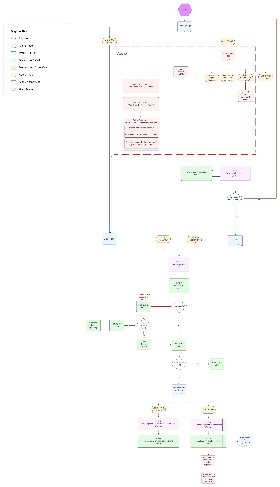

# Auth0

Tekalo uses [Auth0](https://manage.auth0.com) as its authentication mechanism for applicants. Tekalo has 2 Auth0 tenants:
* [sf-capp-dev](https://manage.auth0.com/dashboard/us/sf-capp-dev/) for both Tekalo's dev and staging environments
* [sf-futuresengine-prod](https://manage.auth0.com/dashboard/us/sf-futuresengine-prod/) for only Tekalo's production environment

## Flow

## Actions

Tekalo uses 3 [Auth0 actions](https://auth0.com/docs/customize/actions) to customize the login flow. All 3 actions will be triggered every time a user logs in to Tekalo.

### 1. **Add-Email-To-Access-Token***
Adds the user's email to the Auth0 access token. This allows the API to validate the JWT matches the applicant's email when calling various API endpoints that require authentication.

### 2. **Add-Role-To-Access-Token**
Adds any roles in auth0 to the Auth0 access token for reference by the API. Roles are used by the API 's Authenticator class to validate a user has a given role before being authorized to access a given endpoint. Current roles include:
- matchmaker
- admin

Additional roles can be added through the Auth0 management console from the left side bar: `User Management` > `Roles` > `Create Role`. You can add new users to existing roles by clicking on the role name ane selecting the `Users` tab.

### 3. **Post-Social-Login-Delete-Shell-User**

#### Background
When designing the Tekalo user experience, we wanted to support both custom password and social identity provider authentication. We also wanted a seamless submission flow, where users could submit their Tekalo application without needing to create an account/password or verify their account first.

#### Flow
When an applicant is first created in Tekalo (`POST /applicants`), the API calls the Auth0 Management API to create a shell user in Auth0. This shell user has connection type `Username-Password-Authentication` with no password set. This sets up the applicant as an Auth0 user, allowing them to set a new password through the Auth0 reset password flow.

When an applicant returns to the site, they'll need to login to revisit their account/submission. On their return to Tekalo:

- If the applicant tries logging in with a social identity provider, Auth0 will automatically create a new user for this applicant with connection type Google or Linkedin. Since we never want 2 Auth0 users for a single Tekalo applicant (their existing shell user still exists), this action will:

  1. Delete the previously created shell user (ensuring that the user has not yet set a password) in favor of the newer user with social identity provider.
  2. Add a `has_cleaned_shell_account` boolean flag to the user's `app_metadata`

  3. Set a custom `auth0.capp.com/exists_in_db` claim in the Auth0 id token

- If the applicant chooses not to use a social identity provider, they can create a password for their account via the Tekalo login page password reset link. The shell account, which already has connection type `Username-Password-Authentication` will be updated with the new password set by the user. This converts the shell account into a verified user account.

If Auth0 account linking is setup, this action will no longer be necessary.
