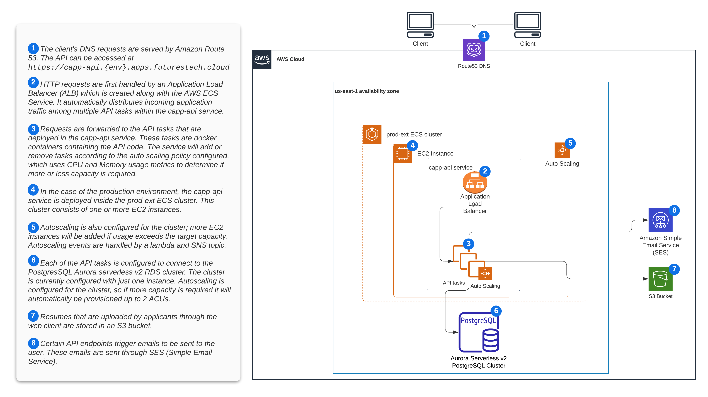

# Infrastructure

## AWS

The infrastructure for all three Tekalo API environments (dev, staging, prod) is deployed to AWS. Dev and staging are deployed to the same AWS account, while prod is isolated in its own AWS account.

## Configuration

We use infrastructure as code (IaC) to configure the infrastructure of the Tekalo API, and avoid making manual edits in the AWS console as much as possible. Most of the infrastructure configuration is in the form of terraform code, and can be found in [the terraform directory](../tf) in this repo. The configuration for the ECS cluster, the vpc, and other related infrastructure is configured using CloudFormation, and can be found in the [aws-infrastructure](https://github.com/schmidtfutures/aws-infrastructure/fan-apps-prod) repository.

## DNS

The domain name is in AWS Route53 and the SSL cert can be found in AWS Certificate manager. Both of these are configured in the aws-infrastructure repo.

## Application containers and load balancer

The API application runs in an ECS cluster. There is currently one EC2 instance deployed to the cluster. Autoscaling is configured for the cluster and nodes will be added when capacity reaches 100%. The cluster hosts two services on its EC2 instances. The `capp-api` service consists of tasks that contain the API code. This service is also configured to auto-scale based on CPU and Memory usage metrics.

## Container images

When code is merged into the `main` branch a build and deploy is triggered through github actions. A new container image is built and pushed to AWS ECR. This image will then be deployed to the `capp-api` cluster, starting with dev. The same image is used for all three environments.

## Database

An Aurora Serverless v2 PostgreSQL RDS cluster supports the API. Credentials for the database are stored in Secrets Manager and are accessed and set in the task container at deploy time. Automatic rotation of the database password has been configured. The API tasks [will shut down if a database authentication error is detected](https://github.com/schmidtfutures/common-app-api/blob/main/src/resources/client.ts#L24-L28), allowing new tasks to be started with the new password.

There is currently only one database instance in the cluster, though it would probably make sense to deploy a replica to prevent downtime if there is a database failure.

## Storage

Applicant resumés are stored in S3. The API generates a signed S3 upload link upon client request and generates a signed link to retrieve the resume for logged-in users with sufficient permissions. The S3 bucket has been configured with intelligent tiering to reduce storage costs.

## Email

SES

## Logs

CloudWatch

## Metrics, dashboards, and alarms

CloudWatch
