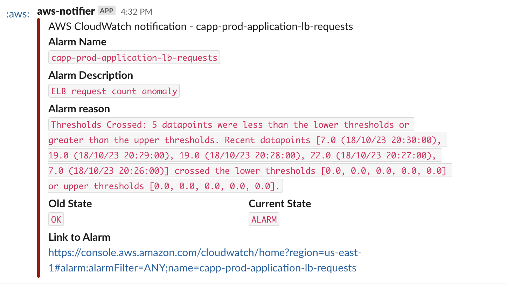

# Operations

Monitoring of the Tekalo API is configured in [Sentry](https://schmidt-futures.sentry.io/issues/?project=4504963428777984) and [AWS CloudWatch](https://us-east-1.console.aws.amazon.com/cloudwatch/home?region=us-east-1#dashboards/dashboard/capp-api-prod).
Alarms have been set up to detect anomalous behavior and will trigger alerts in [PagerDuty](https://schmidtfutures.pagerduty.com/incidents).

CloudWatch alarms are configured in [terraform](tf/modules/app/alarms.tf), while Sentry alarms are configured manually in the Sentry console.

[Hightouch](https://app.hightouch.com/common-app/extensions/alerting/configuration) syncs are also configured to alert through PagerDuty on sync error.

Alerts are also configured in Sentry for the front-end application. Sentry is only configured to capture errors on static pages for the front-end, as it wasn't possible to set up Sentry for the middleware or proxy API due to limitations of Cloudflare (where the front-end is deployed). [Related ticket](https://github.com/cloudflare/next-on-pages/issues/174).

For the most part alerts are configured only to trigger on production. Hightouch alerts are an exception to this as it is not currently possible to configure alerts per environment.

## Where to go to investigate problems

- [CloudWatch dashboard](https://us-east-1.console.aws.amazon.com/cloudwatch/home?region=us-east-1#dashboards/dashboard/capp-api-prod)
- [Sentry](https://schmidt-futures.sentry.io/issues/?project=4504963428777984&statsPeriod=24h)
- [Auth0 logs](https://manage.auth0.com/dashboard/us/sf-futuresengine-prod/logs). We also [export Auth0 logs to CloudWatch](https://us-east-1.console.aws.amazon.com/cloudwatch/home?region=us-east-1#logsV2:log-groups/log-group/$252Faws$252Fevents$252Fauth0-tekalo-prod) where they are retained for 30 days.
- [Cloudflare](https://dash.cloudflare.com/309c4f3506fe434b9e11883d029ed0f1/tekalo.org) (for front-end issues)

## Common alerts and their meanings

### API error count

This alert comes from Sentry and indicates that there are one or more errors coming from the API. We've configured Sentry to alarm on any error because the Tekalo API very rarely throws unhandled errors. Most likely if you see this alert it will be because there is a problem with code that was recently merged / deployed to production.

### API request failure rate

This alert comes from Sentry and indicates that there is a high percentage (over 25%) of requests that are returning a 5xx status over the last 5 minutes. If you see this alert it is also most likely because problematic code has been deployed to production and is affecting a significant proportion of requests. It could also indicate some kind of nefarious activity (denial of service attack, etc), though that is less likely.

### API request latency, POST /applicants API request latency

This alert comes from Sentry and indicates that the API or specific endpoints are slower than expected. A separate alert has been configured for the `POST /applicants` endpoint, as it is especially slow due to awaiting email sends. This alert could indicate a problem with the database or network issues. Further investigation can be done through Sentry and / or CloudWatch to narrow down the cause.

### Sync [sync #] failed with error: error message

This alert comes from Hightouch and indicates that there is a problem with the sync from the API Postgres database and Airtable. Sometimes the cause of the sync failure is a temporary outage of the Hightouch service. Check the [Hightouch status page](https://status.hightouch.io/) to see if there is a problem.

### ELB request count anomaly

This is a warning that appears in slack. It indicates that there is either more or less traffic than usual coming to the load balancer for the Tekalo site. It can indicate that there is a problem with users reaching the site or that there is an unusual volume of traffic being directed to the site, but since traffic to Tekalo is usually very low volume this warning usually just indicates a small burst in traffic to the site. Usually nothing needs to be done about this warning. To futher investigate the warning, check out the ALB Request Count by Status tile on the [CloudWatch dashboard for Tekalo](https://us-east-1.console.aws.amazon.com/cloudwatch/home?region=us-east-1#dashboards/dashboard/capp-api-prod).
