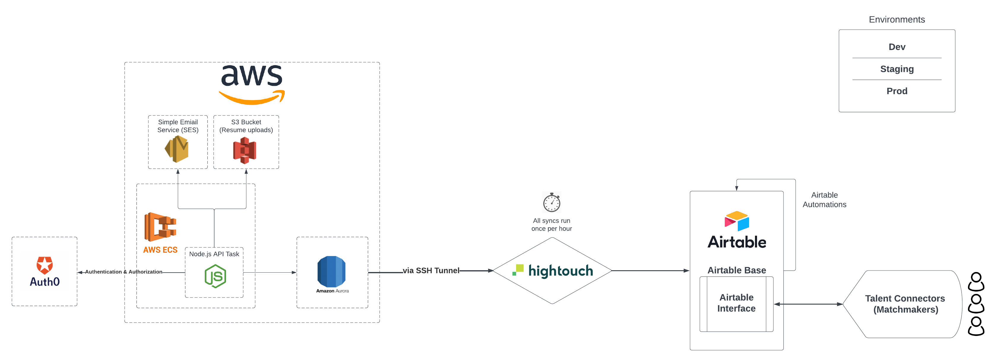

# Data ReadMe

At it's core, Tekalo is about getting data about candidates and opportunities to talent connectors. In order to do this, we have flows for users to fill out and edit their forms, but we need to get that data into an interface that talent connectors will be comfortable interacting with. The data pipeline is responsible for fetching the data from the backend's database and loading that data into Airtable, where certain automations are enacted upon it and the talent connectors can start their work.

## ETL Pipeline

Below is a diagram depicting Tekalo's backend architecture, including the tools and process we use for ETL. This entire pipeline is replicated for each of our three deployment environments (dev, staging, prod).

